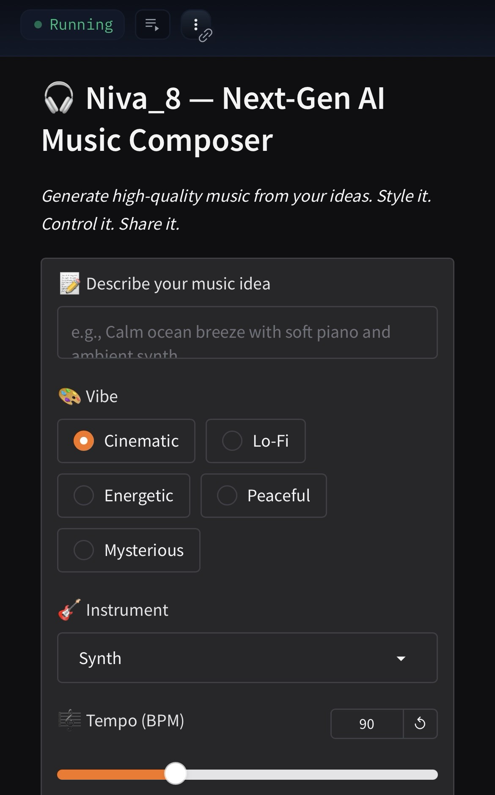

<link rel="stylesheet" href="theme.css">

# 🎧 NivaBand — AI Music Generator with Chord Intelligence

**Create music from your soul using only your words.**  
Describe it. Shape it. Hear it.

Powered by [MusicGen](https://huggingface.co/facebook/musicgen-melody),  
NivaBand transforms imagination into high-quality, emotionally rich music.

---

## 🚀 How It Works
1. **Describe** your musical vision (e.g., *Triumphant Afro-fusion with deep bass and strings*)  
2. **Customize** vibe, instrument, tempo, and duration  
3. (Optional) **Add chords or melody** to guide the track  
4. Click **Generate Music** 🎶  

---

## 🎛 Features
- 🧠 Smart AI prompt enhancer  
- 🎼 Optional chord/melody input (`music21`)  
- 🎨 Custom UI theme via `theme.css`  
- ⚡ Outputs WAV audio in seconds  

---

## 🧠 Tech Stack
- `gradio` + `transformers` + `torch`  
- `music21` (for chords/notes)  
- `scipy`, `uuid`  

---

## 📷 Preview

---

## 💜 Built for Visionaries
NivaBand is the **musical expression of Eden**.  
Just like GPT unlocks words,  
**NivaBand unlocks infinite music**.  

Built with 💜 using [Gradio](https://gradio.app) + [Transformers](https://huggingface.co/docs/transformers/index).
